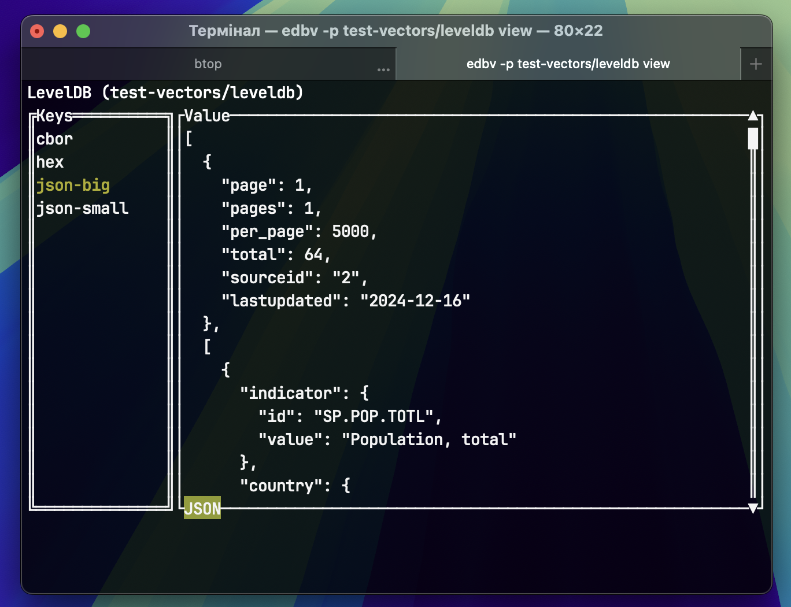

# Embedded Databasses Viewer

`edbv` provides simple interface for viewing embedded key-value
databases.

> [!WARNING]
>
> Current implementation is only proof-of-concept.



## Usage

For manual testing generate databases using `xtask`:

```shell
cargo xtask generate --output test-vectors
```

And run `edbv`:

```shell
cargo run -- -p test-vectors/leveldb view
```

## Roadmap

- Add manual change of modes for values (with context menu);
- Add vim-like keybindings;
- More general keybindings (like page scroll);
- Support other embedded databases:
  - [ ] `leveldb`
  - [ ] `rocksdb`
  - [ ] `sled`
  - [ ] ...
- More serialization formats:
  - [x] JSON
  - [x] CBOR
  - [ ] MessagePack
  - [ ] Protobuf
